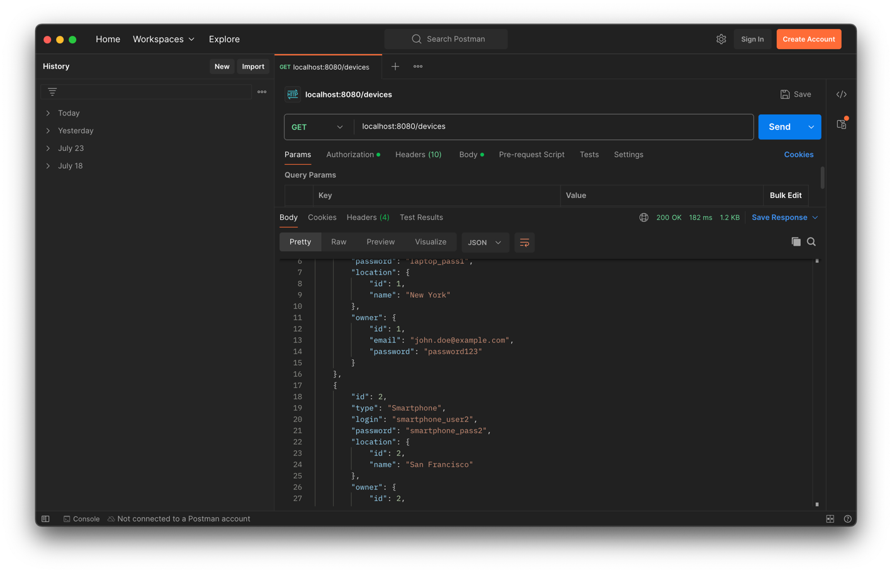

# A simple aiohttp API

GET/POST/PATCH/DELETE available on /devices
GET /devices/{device_id} for specific device info

### How to run

Clone repository

```
git clone https://github.com/senyehor/aiohttp_API.git
```

install [docker](https://docs.docker.com/engine/install/)  
run this commands

```
docker build -t api .
docker build -f db_docker/Dockerfile -t db_for_api ./db_docker/
docker compose up
```

And voila, api will be available on localhost:8080

